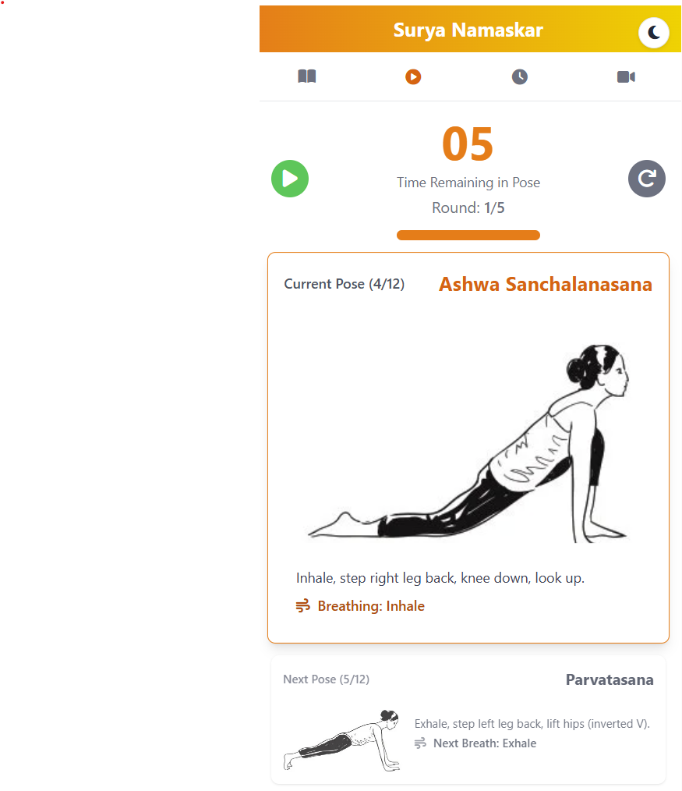

# Surya Namaskar App - Sun Salutation Guide & Practice Timer



A simple, responsive web application designed to guide users through the Surya Namaskar (Sun Salutation) yoga sequence. It provides a step-by-step visual guide and a customizable timer for guided practice sessions, complete with audio cues.

## Features

*   **🧘‍♀️ Pose Guide:** Detailed breakdown of the 12 steps of Surya Namaskar, including:
    *   Clear pose images.
    *   Concise instructions for each pose.
    *   Breathing cues (Inhale, Exhale, Hold Breath, Normal).
*   **⏱️ Guided Practice:** A timer-based practice mode:
    *   Visual display of the current pose and the upcoming pose.
    *   Remaining time countdown for the current pose.
    *   Progress bar showing time elapsed in the current pose.
    *   Round counter to track progress.
    *   Start, Pause, and Reset controls.
*   **⚙️ Customization (Timing Tab):**
    *   Adjust the duration (2-30 seconds) for each of the 12 poses individually using sliders.
    *   Select the total number of practice rounds (3, 5, 10, 12, 24, 108).
    *   Toggle optional audio cues:
        *   **Voice Guidance:** Plays sounds for "Inhale", "Exhale", and "Hold Breath" corresponding to the pose.
        *   **Transition Sounds:** Plays a soft beep between poses.
    *   Settings are automatically saved in your browser's `localStorage` for persistence.
*   **🔊 Audio Cues:** Includes `.mp3` files for inhale, exhale, hold breath, and transition sounds (used in Guided Practice based on settings).
*   **▶️ Video Demonstration:** Embedded YouTube video showing the full sequence.
*   **📱 Responsive Design:** Built with Tailwind CSS for adaptability across different screen sizes (mobile-first approach).
*   **⚡ PWA Enabled:**
    *   **Installable:** Can be installed on supported desktop and mobile devices for an app-like experience.
    *   **Offline Access:** Works offline after the first visit, thanks to the Service Worker caching essential assets (HTML, CSS, JS, images, audio).

## Tech Stack

*   **HTML5:** Structure of the application.
*   **CSS3:** Styling.
    *   **Tailwind CSS:** Utility-first CSS framework for rapid UI development.
*   **JavaScript (Vanilla JS):** Application logic, timer, settings management, PWA registration, audio playback.
*   **Font Awesome:** Icons.
*   **Service Worker API:** For PWA features (offline caching).


## Usage

*   **Navigation:** Use the tabs (Guide, Practice, Timing, Video) at the top to switch between sections.
*   **Pose Guide:** Scroll through the 12 poses to learn the sequence, instructions, and breathing.
*   **Timing:**
    *   Use the sliders to set the desired duration for each pose.
    *   Select the total number of rounds from the dropdown.
    *   Check/uncheck the boxes for Voice Guidance and Transition Sounds.
    *   Click "Save Settings". Your preferences will be stored locally.
*   **Guided Practice:**
    *   Click "Start" to begin the timed practice based on your saved settings.
    *   Use "Pause" to temporarily stop and "Start" again to resume.
    *   Use "Reset" to return to the beginning of Round 1, Pose 1.
    *   Follow the visual cues (current/next pose) and audio cues (if enabled).
*   **Video:** Watch the embedded video for a visual demonstration.

## PWA Features

*   On supported browsers (like Chrome, Edge on Desktop/Android), you may see an "Install" icon in the address bar or be prompted to add the app to your home screen.
*   Once installed, the app can be launched like a native application.
*   After your first visit with an internet connection, the app should load and function offline, using the cached assets.

## File Structure

```
├── assets/
│   ├── Surya-Namaskar-step-1.jpg # Pose images
│   ├── Surya-Namaskar-step-2.jpg
│   ├── ...
│   ├── Surya-Namaskar-step-12.jpg
│   ├── exhale.mp3    # Audio cues
│   ├── hold.mp3
│   ├── inhale.mp3
│   └── soft_beep.mp3
├── index.html        # Main application file
├── sw.js            # Service Worker script
├── icon.png         # App icon (for PWA/favicon)
├── Screenshot.png   # App screenshot for documentation
└── README.md        # Documentation
```

## Contributing

Feel free to contribute to this project by:
- Reporting bugs
- Suggesting new features
- Submitting pull requests
- Improving documentation

## Future Enhancements

- [ ] Integrate corresponding mantras for each pose
- [ ] Add different speed presets (Beginner, Intermediate, Advanced)
- [ ] Include brief descriptions of pose benefits and modifications
- [ ] Add smoother visual transitions between poses
- [ ] Support multiple languages
- [ ] Add progress tracking and statistics
- [ ] Implement user accounts and cloud sync (optional)

## License

This project is [MIT licensed](LICENSE).

---
Made with ❤️ by [Naren Tiwari](mailto:tiwarinaren@gmail.com)
